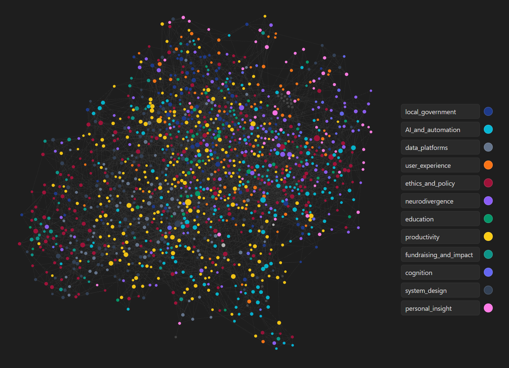

# Metisem - Markdown Semantic Analysis Toolkit

**Automatically discover semantic connections, auto-tag, and summarise your markdown knowledge base**

Transform your markdown notes into an interconnected web of ideas. Metisem analyses note content using state-of-the-art NLP to generate intelligent backlinks, auto-tag notes, and create AI-powered summaries, helping you surface hidden connections and navigate large vaults with ease.

Compatible with Obsidian, Logseq, and other markdown-based knowledge management tools.

Built for researchers, PKM enthusiasts, and anyone managing extensive markdown collections.

---

## Overview

Three specialized tools for enhancing your markdown vault:

- **Semantic Linker** (`main.py`) - Generates contextual backlinks between related notes based on content similarity
- **Auto-Tagger** (`tagger.py`) - Intelligently tags notes by matching content against custom tag descriptions
- **Summariser** (`summariser_ollama.py`) - Creates concise summaries using local LLMs via Ollama

All tools leverage [Sentence Transformers](https://www.sbert.net/) for semantic understanding, with intelligent caching that automatically detects content changes via SHA256 hashing.



---

## Features

### Semantic Link Generator
- **Content-aware linking** -Uses cosine similarity on embeddings to identify semantically related notes
- **Customizable thresholds** -Control link quantity and quality with configurable similarity scores
- **Non-invasive** -Links are inserted in clearly marked sections that can be updated or removed anytime
- **Incremental caching** -Only re-processes files whose content has changed
- **GPU acceleration** -Automatically uses CUDA when available for faster embedding generation

### Auto-Tagger
- **Semantic tag matching** -Tags notes based on conceptual similarity to tag descriptions, not just keywords
- **Custom taxonomies** -Define your own tag vocabulary with human-readable descriptions
- **YAML front matter integration** -Seamlessly works with Obsidian's native tag system
- **Batch operations** -Tag entire vaults in one pass

### Summariser (Ollama)
- **Local LLM integration** -Generates summaries using models running on your machine (privacy-first)
- **Configurable prompts** -Optimized for conversational content, easily customizable
- **Flexible deployment** -Point to any Ollama instance via environment variable

---

## About the Name

**Metisem** combines "Metis" (Greek goddess of wisdom and counsel) with "semantic" -reflecting the tool's purpose of bringing intelligent semantic understanding to your knowledge base.

---

## Quick Start

### Installation

**Prerequisites:** Python 3.8+, pip

```bash
# Clone repository
git clone https://github.com/PFunnell/metisem.git
cd metisem

# Install dependencies
pip install -r requirements.txt

# Verify installation
python main.py --help
```

### Generate Semantic Links

```bash
# Preview links (dry run)
python main.py /path/to/vault

# Apply links to notes
python main.py /path/to/vault --apply-links

# Customize similarity threshold and link count
python main.py /path/to/vault --apply-links --similarity 0.7 --max-links 5
```

### Auto-Tag Notes

```bash
# Create tags.txt defining your taxonomy
echo "productivity::Time management, GTD, task organisation" > tags.txt
echo "learning::Education, skill development, studying" >> tags.txt

# Apply tags to vault
python tagger.py /path/to/vault --tags-file tags.txt --apply-tags
```

### Generate Summaries

```bash
# Install and start Ollama (one-time setup)
# Visit https://ollama.ai for installation instructions
ollama serve
ollama pull mistral

# Generate summaries
python summariser_ollama.py /path/to/vault --apply-summaries
```

---

## Usage

### Semantic Linker Options

```bash
python main.py <vault_path> [options]
```

| Option | Default | Description |
|--------|---------|-------------|
| `--apply-links` | False | Write links to files (default is preview mode) |
| `--similarity` | 0.6 | Minimum similarity score (0.0-1.0) for linking |
| `--min-links` | 0 | Minimum links per note (fallback below threshold) |
| `--max-links` | 9 | Maximum links per note |
| `--model` | all-MiniLM-L6-v2 | Sentence Transformer model to use |
| `--clusters` | 0 | K-means clusters for intra-cluster linking |
| `--delete-links` | False | Remove existing link sections before adding new |
| `--force-embeddings` | False | Regenerate all embeddings (ignore cache) |
| `--verbose` | False | Enable debug logging |

**Example workflows:**

```bash
# High-quality links only
python main.py ~/vault --apply-links --similarity 0.8 --max-links 3

# Ensure every note has some links
python main.py ~/vault --apply-links --min-links 2 --max-links 10

# Remove all auto-generated links
python main.py ~/vault --delete-links --apply-links
```

### Auto-Tagger Options

```bash
python tagger.py <vault_path> --tags-file <file> [options]
```

| Option | Default | Description |
|--------|---------|-------------|
| `--tags-file` | Required | Path to tag definitions file |
| `--apply-tags` | False | Write tags to files (default is preview mode) |
| `--remove-tags` | False | Remove all existing tags |
| `--model` | all-MiniLM-L6-v2 | Sentence Transformer model to use |
| `--force-embeddings` | False | Regenerate all embeddings |
| `--verbose` | False | Enable debug logging |

**Tag file format:**

Each line defines a tag using `tag_name::description` syntax:

```
machine_learning::Neural networks, deep learning, ML algorithms and techniques
philosophy::Metaphysics, epistemology, ethics, philosophical inquiry
project_management::Agile, scrum, project planning and execution
```

The description is embedded and compared semantically to note content.

### Summariser Options

```bash
python summariser_ollama.py <vault_path> [options]
```

| Option | Default | Description |
|--------|---------|-------------|
| `--apply-summaries` | False | Write summaries to files |
| `--delete-summaries` | False | Remove existing summaries |
| `--model` | mistral | Ollama model to use |
| `--max-summary-length` | 128 | Maximum tokens per summary |
| `--max-files` | None | Limit number of files to process |
| `--verbose` | False | Enable debug logging |

**Environment variables:**

- `OLLAMA_HOST` -Ollama server address (default: `localhost:11434`)

---

## How It Works

### Intelligent Caching

All tools implement incremental caching:

1. **Content hashing** -Each file's content is SHA256-hashed
2. **Cache lookup** -Existing embeddings are loaded from `.metisem_cache/`
3. **Change detection** -Cached embeddings are used only if hashes match
4. **Selective re-embedding** -Only modified files are re-processed
5. **Cache update** -New embeddings are saved for future runs

This means the first run is slow (generates all embeddings), but subsequent runs are fast (only processes changed files).

### When to Use `--force-embeddings`

Force cache regeneration when:
- Switching transformer models (`--model`)
- Comparing results across different models
- Suspecting cache corruption

**Not needed** for normal operations - content changes are detected automatically.

### Model Selection

Default model: `all-MiniLM-L6-v2` (fast, good quality, 384-dim embeddings)

Alternative models:
- `all-mpnet-base-v2` -Higher quality, slower (768-dim)
- `paraphrase-multilingual-MiniLM-L12-v2` -Multilingual support
- Any [Sentence Transformers](https://www.sbert.net/docs/pretrained_models.html) model

---

## Configuration

### Performance Tuning

**For large vaults (1000+ notes):**
```bash
# Use smaller batch size to reduce memory
python main.py ~/vault --apply-links --batch-size 16

# Process subset for testing
python main.py ~/vault --max-links 5 --verbose
```

**For GPU acceleration:**
- Install PyTorch with CUDA support
- Verify CUDA availability: `python -c "import torch; print(torch.cuda.is_available())"`
- GPU is used automatically when detected

### Customization

**Link section formatting:**
Links are inserted between HTML comment markers for easy identification:
```markdown
<!-- AUTO-GENERATED LINKS START -->
## Related Notes
[[Note 1]]
[[Note 2]]
<!-- AUTO-GENERATED LINKS END -->
```

**Tag integration:**
Tags are added to YAML front matter:
```yaml
---
tags:
- machine_learning
---
```

---

## Development

### Setup

```bash
# Clone and create environment
git clone https://github.com/PFunnell/metisem.git
cd metisem

# Using conda
conda create -n obsidian-linker python=3.8
conda activate obsidian-linker

# Using venv
python -m venv .venv
source .venv/bin/activate  # Windows: .venv\Scripts\activate

# Install dependencies and dev tools
pip install -r requirements.txt
pip install mypy pre-commit
pre-commit install
```

### Code Quality

- **Type hints** -Full type annotations on all public functions
- **Linting** -Ruff configured in `pyproject.toml`
- **Pre-commit hooks** -Automatic formatting and validation
- **Type checking** -Run `mypy main.py tagger.py summariser_ollama.py --ignore-missing-imports`

See [CONTRIBUTING.md](CONTRIBUTING.md) for detailed guidelines.

---

## Troubleshooting

### Common Issues

**"Module not found" errors**
```bash
pip install -r requirements.txt
python --version  # Verify Python 3.8+
```

**Slow first run**
Expected behaviour - embeddings are being generated for all files. Subsequent runs will be much faster.

**Out of memory errors**
Reduce batch size: `--batch-size 8` (default: 32)

**Ollama connection errors**
```bash
# Verify Ollama is running
ollama serve

# Check custom host configuration
export OLLAMA_HOST=localhost:11434
```

**Cache issues**
Delete cache directory to force full rebuild:
```bash
rm -rf /path/to/vault/.metisem_cache/
```

### Advanced Debugging

Enable verbose logging to diagnose issues:
```bash
python main.py ~/vault --verbose
```

---

## Background

This toolkit emerged from the challenge of navigating hundreds of ChatGPT conversation exports imported to Obsidian. By automatically discovering semantic relationships between notes, it transformed an overwhelming collection into a navigable knowledge graph.

While originally designed for AI conversation archives (via [nexus-ai-chat-importer](https://github.com/Superkikim/nexus-ai-chat-importer)), the tools work equally well for any markdown collection - research notes, meeting minutes, blog drafts, or personal knowledge bases.

---

## Contributing

Contributions are welcome! Please see [CONTRIBUTING.md](CONTRIBUTING.md) for:
- Code style guidelines
- Development workflow
- Pull request process
- Testing procedures

## License

MIT License - see [LICENSE](LICENSE) for details.

---

**Questions?** Open an issue or discussion on GitHub.
